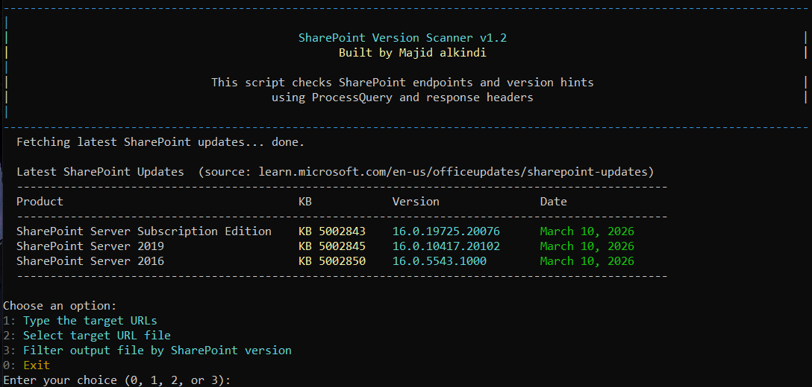

# SharePoint Version Scanner

A C# console tool that scans SharePoint hosts and detects version information using multiple endpoints and fallbacks.

## Screenshot



## Features

- Fetches and prints the latest SharePoint update entries at startup for:
  - SharePoint Server Subscription Edition
  - SharePoint 2019
  - SharePoint 2016
- Supports two input modes:
  - Manual host entry
  - File input (extracts domains/IPs and normalizes to `https://...`)
- Tries version detection in this order:
  1. `/admin/_vti_bin/client.svc/ProcessQuery`
  2. `/en/_vti_bin/client.svc/ProcessQuery`
  3. `/_vti_bin/client.svc/ProcessQuery`
  4. `/_api/contextinfo` (parses `<d:LibraryVersion>`)
  5. Response-header fallback detection
- ASCII progress animation while requests are running
- Optional verbose mode (request/response details)
- Optional SSL certificate bypass mode for diagnostics
- Optional output saving to a text file (prints full save location)
- Colored console output:
  - LibraryVersion in cyan
  - Version in green
  - Errors in red

## Requirements

- .NET 7 SDK
- Internet access to target hosts

## Build And Run

```powershell
dotnet build SharePointVersionScanner.csproj
dotnet run --project SharePointVersionScanner.csproj
```

## Interactive Flow

The tool prompts for:

1. Host input method
2. Verbose output (`y/n`)
3. Ignore SSL certificate errors (`y/n`)
4. Save output to file (`y/n`)
5. Output path (if save is enabled)

When saving is enabled, the scanner prints:

- `Output will be saved to: <full path>` before scan
- `Output saved to: <full path>` after write completes

## Version Mapping

- `14.x` -> SharePoint 2010
- `15.x` -> SharePoint 2013
- `16.0` -> SharePoint 2016/2019/Online/SE
- `16.x` -> SharePoint Online or 2019
- `17.x` -> SharePoint Server Subscription Edition

## Notes

- SSL bypass mode is insecure and should only be used for testing/diagnostics.
- Some sites may still require authentication or block requests based on security policy.
