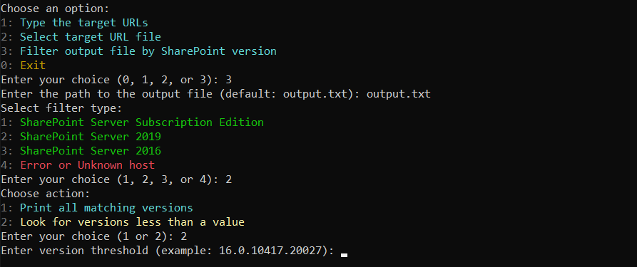

# SharePoint Version Scanner

A C# console tool that scans SharePoint hosts and detects version information using multiple endpoints and fallbacks.

## Screenshot


### Filter Output File Flow

This screen shows the flow for:

- `Filter output file by SharePoint version`
- `Select filter type`
- `Enter version threshold (example: 16.0.10417.20027)`



## Features

- Fetches and prints the latest SharePoint update entries at startup for:
  - SharePoint Server Subscription Edition
  - SharePoint 2019
  - SharePoint 2016
- Supports two input modes:
  - Manual host entry
  - File input (extracts domains/IPs and normalizes to `https://...`)
- Tries version detection in this order:
  1. `/admin/_vti_bin/client.svc/ProcessQuery`
  2. `/en/_vti_bin/client.svc/ProcessQuery`
  3. `/_vti_bin/client.svc/ProcessQuery`
  4. `/_api/contextinfo` (parses `<d:LibraryVersion>`)
  5. Response-header fallback detection
- ASCII progress animation while requests are running
- Optional verbose mode (request/response details)
- Optional SSL certificate bypass mode for diagnostics
- Optional output saving to a text file (prints full save location)
- Colored console output:
  - LibraryVersion in cyan
  - Version in green
  - Errors in red

## Requirements

- .NET 7 SDK
- Internet access to target hosts

## Build And Run

```powershell
dotnet build SharePointVersionScanner.csproj
dotnet run --project SharePointVersionScanner.csproj
```

## Interactive Flow

### Startup

When the application starts, it:

1. Prints the console banner.
2. Fetches the latest SharePoint update history from Microsoft for:
   - SharePoint Server Subscription Edition
   - SharePoint Server 2019
   - SharePoint Server 2016
3. Displays the latest detected KB, version, and date.

If update retrieval fails or times out, the tool skips that step and continues.

### Main Menu

The main menu shows these options:

1. `1` - Type the target URLs
2. `2` - Select target URL file
3. `3` - Filter output file by SharePoint version
4. `0` - Exit

Prompt shown:

```text
Enter your choice (0, 1, 2, or 3):
```

### Scan Flow

If option `1` is selected:

1. The tool prompts:

```text
Enter SharePoint URLs :
```

2. Enter one URL per line.
3. Submit an empty line to finish input.

If option `2` is selected:

1. The tool prompts:

```text
Enter the path to the file containing URLs:
```

2. It reads the file and extracts domains or IPs.
3. Extracted values are normalized to `https://...`.

After host collection, the tool prompts for:

1. `Enable verbose output? (y/n):`
2. `Ignore SSL certificate errors? (y/n):`
3. `Save output to file? (y/n):`

If saving is enabled, it then prompts:

```text
Enter output file path (default: output.txt):
```

The scanner prints the resolved full path before the scan begins:

- `Output will be saved to: <full path>`

Then it prints the host count:

- `Found <count> hosts to scan.`

### Per-Host Scan Behavior

For each host, the tool prints:

```text
[current/total] Scanning: <host>
```

It then tries version detection in this order:

1. `/admin/_vti_bin/client.svc/ProcessQuery`
2. `/en/_vti_bin/client.svc/ProcessQuery`
3. `/_vti_bin/client.svc/ProcessQuery`
4. `/_api/contextinfo`
5. Response-header fallback detection

While waiting for responses, the tool shows an ASCII progress animation.

If a version is found, the result is printed as:

- `Host: <host>, LibraryVersion: <version>, Version: <mapped product>`

If no version is found, the result is printed as:

- `Host: <host>, Error: <message>`

After the scan completes, if saving is enabled, the tool prints:

- `Output saved to: <full path>`

Then it returns to the menu with:

- `Scan completed. Returning to main menu...`

### Filter Flow

If option `3` is selected, the tool prompts:

```text
Enter the path to the output file (default: output.txt):
```

If the file does not exist, it prints:

- `File not found: <full path>`

Then it asks for the filter type:

1. `1` - SharePoint Server Subscription Edition
2. `2` - SharePoint Server 2019
3. `3` - SharePoint Server 2016
4. `4` - Error or Unknown host

Prompt shown:

```text
Enter your choice (1, 2, 3, or 4):
```

For filter types `1`, `2`, and `3`, the tool asks for an action:

1. `1` - Print all matching versions
2. `2` - Look for versions less than a value

Prompt shown:

```text
Enter your choice (1 or 2):
```

If option `2` is selected, it asks for a threshold:

```text
Enter version threshold (example: 16.0.10417.20027):
```

If the version format is invalid, it prints:

- `Invalid version format. Use numbers like 16.0.10417.20027`

The filter results section prints:

1. `Filtering: <full path>`
2. `Results for: <selected product>`
3. `Condition: LibraryVersion < <threshold>` when less-than filtering is enabled
4. Matching entries, colorized when displayed in the console
5. `Total matches: <count>` when matches are found

If no entries match, it prints:

- `No matching entries found.`

After displaying filter results, the tool returns directly to the main menu.

### Exit Flow

If option `0` is selected, the tool prints:

- `Exiting...`

## Version Mapping

- `14.x` -> SharePoint Server 2010
- `15.x` -> SharePoint Server 2013
- `16.0.19xxx.xxxx` -> SharePoint Server Subscription Edition
- `16.0.10xxx.xxxx` -> SharePoint Server 2019
- `16.0.5xxx.xxxx` -> SharePoint Server 2016
- `17.x` -> SharePoint Server Subscription Edition

## Notes

- SSL bypass mode is insecure and should only be used for testing/diagnostics.
- Some sites may still require authentication or block requests based on security policy.
